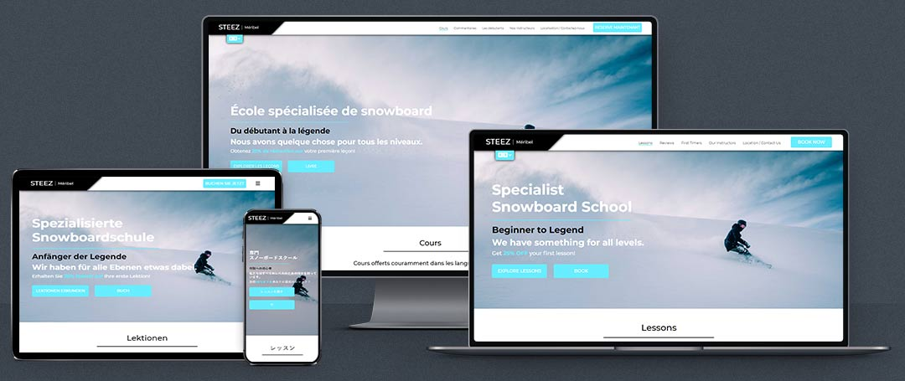
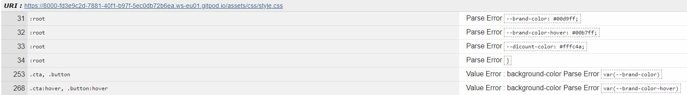
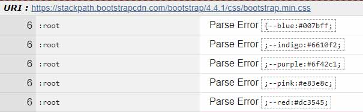
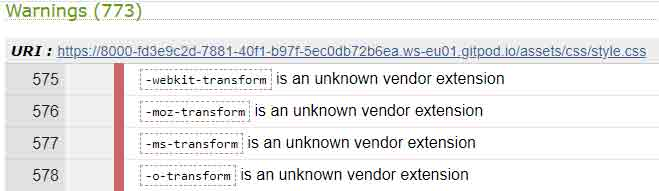
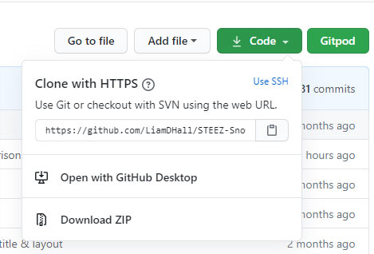
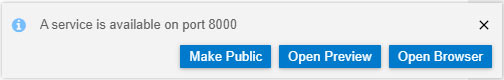

# STEEZ Meribel Snowboard School
*Liam Hall Milestone Project 1 (User Centric Frontend Development)*

This is my first project studying with [The Code Institute](https://codeinstitute.net/)

The aim of this project is to create a font-end web application focusing on responsiveness, accessibility and user experience.
 
I chose to make a website for a specialist snowboard school in Méribel in the French Alps. 

The target audience for this website are all alpine enthusiasts, whether they are experienced or a complete beginner.

STEEZ provides snowboard lessons in 7 of the most popular languages across alpine resorts. 

The site can easily be translated into these languages via the Google Translate tab attached to the header (indicated by a universal symbol).

The website’s goal is to provide the user with all the information they need to find the right lesson for them and allow them to book it. 

The website has been created based on the needs of a real-life business looking to create an online presence.

[View Live Site Here](https://liamdhall.github.io/STEEZ-Snowboard-School/)

## Contents

-   [**UX**](#UX)
    -   [User Stories](#User-Stories)
-   [**Development**]
    -   [Planning](#Planning)
    -   [Ideas](#Ideas)
    -   [Block Element Modifier](#Block-Element-Modifier-Class-Naming-System-BEM)
    -   [CSS Variables](#CSS-Variables)
- [**Features**](#Features)
    -   [Live Features](#Live-Features)
    -   [Features Left to Implement](#Features-Left-to-Implement)
- [**Technologies Used**](#Technologies-Used)
- [**Testing**](#Testing)
    -   [Validation](#Validation)
    -   [Functionality](#Functionality-Testing)
- [**Deployment**](#Deployment)
    -   [Remote Deployment](#GitHub-Pages-Remote-Development)
    -   [Local Deployment](#Cloning-Local-Development)
- [**Credits**](#Credits)

 
## UX

One of the main focuses of this project is to make the website as intuitive as possible with an easy to follow flow of information for the user. 
Pages are designed with this in mind by providing links to external sites or other pages the users will need after viewing the one they are currently on.

With people now viewing most websites on their phone, the website needs to respond to screen size and should be designed with mobile viewing in mind first. 
The website elements need to accommodate the change of input by the user from mouse to touch. 
Clicking a small word on a computer is much easier than trying to press it with a finger.  
I made it so buttons and links are an easy size to press when in mobile layout so the user doesn’t struggle navigating around the website or clicking an element. 

### User Stories

We asked potential users what they would want to get out of using the website:
 
**As a potential user:**

-   experienced at snowboarding I want to easily be able to find out what lessons you offer as well as your instructor’s experience, to see if they are suited to me.
    
    **Homepage > Scroll > Lessons > Our Instructors > Book Now > Payment > Booking Confirmation**

    **Lessons > Our Instructors > Book Now > Payment > Booking Confirmation**

    The lesson information is on the homepage directly below the hero landing.
    The lesson title peaks into the landing screen so the user is encouraged to scroll down.
    A link to the lessons page is first in the main site navigation so it can easily be found from any page. 
    The lessons are then presented in order of difficulty which is shown by the title, directional arrows and the slant of the lesson indicating a group of lessons if on the same level.

    [Lesson Info Fulfilment Screenshots](https://github.com/) - [Live Page](https://liamdhall.github.io/STEEZ-Snowboard-School/index.html#lessons) / [Instructor Fulfilment Screenshots](https://github.com/) - [Live Page](https://liamdhall.github.io/STEEZ-Snowboard-School/our-instructors.html)

-   who’s first language isn’t English I would like the option to be able to view the website in other languages

    **Homepage > Language Selector > Select Language > Scroll > Lessons > Book > Payment > Booking Confirmation**

    Attached to the header is a language selector shown by a universal symbol rather than a word so everyone knows regardless of language its where to click to change the language.
    7 languages are available of the most popular languages across alpine resorts.
    The selector is located in the same place on every page and in the mobile layout it moves into the collapsible navigation.  

    [Translate Fulfiment Screenshots](https://github.com/) On all pages in header or in the mobile collapsible menu.

-   be able to read about other potential client’s experiences, so I have a better insight into how good the lessons and experiences are as well as whether they are worthwhile for me. 
    
    **Homepage > Scroll > Lessons > Scroll > Reviews**

    **Homepage > Scroll > Lessons > Reviews > Book Now**

    **Any Page > Reviews**

    Customer reviews can be found by a link from the header of the lessons, the main site navigation and can be reached by scrolling through all the lessons.
    The review section of the homepage provides insights into previous customer experiences. 
    The review section is a carousel which is divided into the different lessons. 
    
    [Customer Experience Fulfiment Screenshots](https://github.com/) - [Live Page](https://liamdhall.github.io/STEEZ-Snowboard-School/index.html#lesson-reviews)

-   who is a newbie to snowboarding I have no idea what I need or what to expect . It would be great to be provided with this information.

    **Homepage > First Timers > Lessons > Our Instructors > Book Now > Payment > Booking Confirmation**

    **Homepage > Lessons > Our Instructors > Book Now > Payment > Booking Confirmation > First Timers > Get Directions**

    A page has been created for first timers that can be reached easily for the main site navigation. 
    This page provides all the information a person new to snowboarding will need before booking their first lesson. 
    What to expect, what equipment they need and a link to where they can get it. 
    A link to get directions is also at the bottom of the page so they know where to meet for their lesson if they are checking the website just before their lesson to make sure they have everything. 

    [First Timer Screenshots](https://github.com/) - [Live Page](https://liamdhall.github.io/STEEZ-Snowboard-School/first-timers.html)

-   if I book a lesson I will need directions to the company.

    **Lessons > Book Now > Payment > Booking Confirmation > Get Directions**

    **Lessons > Book Now > Payment > Booking Confirmation > First Timers > Get Directions**

    **Homepage > Location/Contact > Get Directions**

    **Lessons > Get Directions**

    Directions can easily be obtained from the main site navigation by clicking the link to the Location/Contact Us page and then by clicking the “Get Directions” button under the location section which then opens Google Maps in a new tab with the end point set to the lessons meet point. 
    On the mobile devices I have tested this site on, Google Maps opens in the app rather than in a new tab.

    There are "Get Directions" buttons throughout the site. There is on one every page in the footer.

    [Directions Fulfilment Screenshots](https://github.com/) On multiple pages.

## Development

### Planning

Please find the planning document [here](https://github.com/). This document contains the following planning stages **Scope, Strategy, Structure** for the website.

### Ideas

The website has changed throughout its development. Please see the sites original wireframes here. [Original Wireframes](https://github.com/).

Originally I was planning for the company to offer more services but later realised they didn’t offer anything to the user experience so removed them.  
I also wanted to include a check availability feature so the user could check if there was space on the lesson they wanted to book. 
However this would need to update for each user as people booked their lesson, this would require code I have not yet studied such as Python.

I re-designed the website to fulfil the users needs more easily.

See [Latest Wireframes](https://github.com/)

Small changes have been made to website with the addition of new pages and links not thought of at the time of creation.

### Commit Messages

At the start of this project I didnt know a lot about git commit messages. 
Therefore my commits at the start of the project my be less detailed and poorly formatted.
During the project I read this [artictal](https://www.theserverside.com/video/Follow-these-git-commit-message-guidelines) and tried to follow it as closely as possible.
-   I tried to keep subject line to 50 character but where appropriate I extended it to 72
-   I wrapped each line of the message body at 72 characters as some repositories don't automatically wrap text to a new lines.
-   If only a single document was edited in the commit I noted it in the commit in the format **document: Subjuct line** so when future developers look through the commits they know
    which document is effected.
-   I only capitalised the first letter of the subject line as some developers use filters that look for capitalisation.

### Block Element Modifier Class Naming System BEM

Starting this project I didn't use BEM but later realised it was very beneficial. 
It allowed me to style new pages very quickly with gernic classes I had styled for previous pages.

The commit that introduces BEM is a large commit as I changed all pages to the system at once.

It also allows future developers to know an elements purpose, structure and if appropriate what it does from the class name.

### CCS Variables

I added CSS Variables (though they caused an error in the validator, see [Validation Testing](#Testing))
so the accent colour throughout the site can be changed by future developers quickly and easily if the company rebrands.
This saves a lot of time. Instead of having to manually change the color value of all rules each time the company rebrands ot uploads new media, only one has to be changed.

### Images Set As Background Images

Images throughout the site are set via CSS as background images. 
This allows for the images to scale better with a change in screen size.
It also allows the position of the images to be set within its div in terms of focus point for its scaling.
I created a section in the CSS where all the images can be changed easily.  

## Features

### Live Features

**Across All Pages**

-	**Fixed Site Header and Main Site Navbar:**  allows users to easily navigate around the site and access site features as the main navbar is always in the same place across all pages and has an indicator as to which page the user is on if it is listed in the navbar. 
    In its mobile form a universal menu icon is displayed which toggles the expanding of the menu. 
    The sites call to action and Google Translate are also housed in this menu when in mobile form. 
    Company logo links to homepage hero image (Landing Page).

-   **Current Page Indicator** allows the user to know from the Main Site Navigation what page they are on if it appears in the navbar. 

    **This feature has issues. See [Testing Results](#Main-Site-Nav-Current-Page-Indicator-on-Homepage)**

-	**Google Translate:** allows the user to change the language of the website by clicking a universal icon for language (similar to Google Translate logo). 
    The website is provided in 7 languages (English, French, Italy, German, Russian, Japanese and Chinese). 
    The language selector has flags of the county the language is for and the name of the language doesn’t translate so the user can easily find their preferred language.
    
    **This feature has issues. See [Bug Report](#Google-Translate-Across-Pages)** 

-	**Location and Google Map (in footer):** allows user to quickly learn the location of the company and get directions with a visual if they are currently in the proximity and just need a reference point. 
    When the user clicks any "Get Directions" button throughout the site it will open Google Maps in a new tabs with a drop pin to STEEZ with all their contact info. 
    It will have the end point of the directions tab auto filled with STEEZ's location. On mobile devices it opens in the Google Maps app. 

-	**Newsletter sign up form (in footer):** allows users to keep up to date on the company’s latest news and provides the business a marketing stream where they can build a mailing list. 

**Homepage / Landing page** 

-	**Hero:** large image designed to immediately grab the attention of the user as they land on the website.
    If their attention is grabbed they will be more likely to explore the rest of the site.

-   **Lesson Product Card:** slanted cards with all the information the user would need to find the right lesson for them. 
    The images for the cards are then cropped with CSS to match the slant. 
    In the mobile version the Product Card is first before its image becasue the user will expect to see the information first as they deem it more important than the image. 
    The opposite to the Instructor Cards.

-   **Review Carousel:** gives the user the availability to read about previous customer experiences. 
    If they are good reviews it encourages new customer to book a lesson. 
    The carousel can be controlled by the user in 3 ways. 
    Firstly by selection of the lesson they want to read reviews for in the list and by using the arrows either side. 
    Finally on mobile devices the user can swipe through the reviews.

**First Timers** 

-   **Icon cards:** small card that gives new comers to snowboarding little bits of information they need.
    Some are linked to an external website where they can purchase the equipment they need for their first lesson. 
    The user can click anywhere on the card and be taken to the enternal site.

**Our Instructors**

-   **Instructor Info Card:** similar to the Lesson Product Cards they are slanted cards with info about the STEEZ Indicators. 
    The images for the cards are then cropped with CSS to match the slant. 
    The image and card are in the opposite order to the Lessons Cards in the mobile version so the user sees the image first and then the information. 
    This is because the user will expect to see a profile picture of someone before their information. 

**Book-Now, Payment & Booking-Confirmation**

-	**Breadcrumb Navbar:** highlights for the user which stage for the booking process they are on and go back if they think they have made a mistake. 
    -   **The list items on the booking page are in a nav without any link. This is so a future developer with more knowledge can later add links so the user can move back and forth between the booking and payment page without losing their progress on either page.**
        **Another reason is the user shouldn't be able to progress to the payment page without first filling in the booking page form. The are links in the nav on the confirmation page to allow the user to go back and check their input. This could easily be replaced with a summary on the confirmation page (Beyond the scope of this project)**

**Homepage, Contact Us, Book Now**

-   **Forms:** 
    -   **Homepage Form:** allows the user to submit a review with a visually **Star Rating**. 
    -   **Contact Us Form:** allows the user to get in touch with the company if they require more information. 
    -   **Book Now Form:** allows the user to book a lesson. **This feature has issues. See [Testing Results](#Form-Submition)**

### Features Left to Implement

These are features I would suggest to improve the site for developers to include if they wish to continue developing this project.

-   **Lesson Availability Checker:** on the booking page have an element that can check the number of spaces left on a lesson.

-   **Weather Page:** have a page that displays the live local weather for the ski resort.

-   **A Link to the Live Weather Cameras on the Mountain:** most ski resorts have weather cameras at the top of ski lifts.

-   **User Accounts:** the user can login in and more easily book a lesson as their details are remembered as well as their preferred payment method. 
    Discounts Could be offered if they book a certain number of lessons to build customer loyalty. 

-   **Booking Confirmation Summary:** provides the user with a receipt of their order so they can see what they have booked.

## Technologies Used

-	[HTML 5](https://en.wikipedia.org/wiki/HTML5): language used to structure and provide content of pages of the website.

-	[CSS 3](https://en.wikipedia.org/wiki/Cascading_Style_Sheets): visual language used to style and format the html.

-	[Javascript](https://en.wikipedia.org/wiki/JavaScript) & [JQuery](https://en.wikipedia.org/wiki/JQuery) (From Third Parties): JavaScript used for frontend functionality. Used for the following:
    -	Collapsible Main Site Navigation – From [Boostrap](https://getbootstrap.com/docs/4.0/components/carousel/#:~:text=like%20a%20carousel.-,How%20it%20works,previous%2Fnext%20controls%20and%20indicators.)
    -	[Google Translate](https://translate.google.co.uk/): used for translating the website.
    -	Form Validation – From [Bootstrap](https://getbootstrap.com/docs/4.0/components/forms/): to give users feedback when they submit a form that has inputs that are incorrect.
    -	[Paypal Payment Button](https://www.paypal.com/buttons/smart?): renders the paypal button and opens its pop up (will open the paypal checkout pop up but it is not linked to an account as is it for demo purposes only).
    -   [Polyfill](https://polyfill.io/): used to make the date selector on the booking page more compatible with older browsers and safari. 

-	[Bootstrap Framework](https://getbootstrap.com/docs/4.1/layout/grid/): provides a grid system to insure a mobile-first design and responsive website which adapts to different screen sizes of devices. 
    Bootstrap also provides the code that makes the collapsible main site navigation and sections that containing forms and the carousel that holds the reviews function.

-	[Iframe]( https://en.wikipedia.org/wiki/IFrame) (From Third Parties): Used for the following: 
    -	[Google Map](https://support.google.com/mymaps/answer/3024454?co=GENIE.Platform%3DDesktop&hl=en) – used to insert google map.
    -	[Paypal Payment Button](https://www.paypal.com/buttons/smart?): used to insert Paypal button.

-   [Gitpod](https://gitpod.io/): the Integrated Development Environment used to write the code for this project. All provides a preview of the website in a browser which was then used for testing.

-   [Gitpod Chrome Extension](https://chrome.google.com/webstore/detail/gitpod-dev-environments-i/dodmmooeoklaejobgleioelladacbeki?hl=en): made it easier and faster to open the repository in my IDE directly from Github in a web browser.

-   [Git](https://git-scm.com/): used for version control and to push the control to a remote repository to be stored.

-   [Github](https://github.com/): used for as a repository to store the versions of the website and to host the live version. 

-   [Adobe Photoshop](https://www.adobe.com/uk/products/photoshop.html): optimise images for the website.

-   [Adobe Illustrator](https://www.adobe.com/uk/products/illustrator.html): optimise icons and create favicon for the website.

-   [Google Font](https://fonts.google.com/): font for website.

-   [Termly](https://app.termly.io/): created the privacy policy and the terms and conditions.

-   [Google Map](https://support.google.com/mymaps/answer/3024454?co=GENIE.Platform%3DDesktop&hl=en) – used to create map a with custom drop pin and company contact info. Also provide the directions to the company when a user click the "Get Directions" Button.

-   [Font Awesome](https://fontawesome.com/) – styles and provides icons.

-   [Country Flags API](https://www.countryflags.io/): country flags in Google Translate dropdown.

-   [Google Chrome](https://www.google.com/intl/en_uk/chrome/), [Microsoft Edge](https://www.microsoft.com/en-us/edge), [Firefox](https://www.mozilla.org/en-GB/firefox/new/) and [Opera](https://www.opera.com): to test browser compatibility.

-   [Google Chrome Dev Tool](https://developers.google.com/web/tools/chrome-devtools): main tool for testing. Inspecting elements and troubleshooting.

## Testing

### **HTML**

I used [W3C Markup Validation Service](https://validator.w3.org/) to check my html was valid.

#### **Errors**

All code written by myself produced no errors in the validator.

However the code from [Solodev](https://jsfiddle.net/solodev/0stLrpqg/) for [Google Translate](https://translate.google.co.uk/) produces the following error:

-   **Bad value #googtrans(en|en) for attribute href on element a: Illegal character in fragment: | is not allowed.**

    I have tried the following to fix the issue: 
    -   Changing the "|" to a legal one "/": this resulted in the translation not working.
    -   add "?/" in front of the hashtag to change it into a link: this still produced the error and Google Translate scripts adds the "?/" automatically anyway.

    **This code is still present. It is my understanding that google translate pulls from a library which requires the illegal charater as it is a name to be called upon by a script.**

    Originally I chose to use [Google Translate Widget](https://www.w3schools.com/HOWTO/howto_google_translate.asp) but due to all the languages being available the 
    dropdown produced after clicking the button was huge and most of the time went off the screen making languages unclickable. It also overwhelmes the user with so many
    options, a lot of which I believed unnecessary.

    I chose to use the code from [Solodev](https://jsfiddle.net/solodev/0stLrpqg/) (Adpated to my needs see [Credits](##Credits)) as it allowed me to select only the languages
    I wanted. It also allowed me to more easily style the button and dropdown to fit into the style of the site and into the mobile nav menu.

#### **Warnings**
    
One warning was produced by my code which is as follows:

-   **The date input type is not supported in all browsers. Please be sure to test, and consider using a polyfill.**

    I have since added a polyfill which fixes this issue when browsing in Safari. (However this was only tested on a very old ipad with an old verison of Safari which can't be 
    updated due to the device no longer being supported.)

    I have tested in Internet Explore and a date selector appears however it shows all dates as being valid inputs even if a max and min have been set.

    I also tried adding placeholder text and a format attribute for the date input but this was flagged as an error as well and has since been removed.

    **Even with the addition of the polyfill this Warning still appears.**

### **CSS**

I used [W3C Jigsaw Validation](https://jigsaw.w3.org/css-validator/) to check my CSS was valid.

#### **Errors**

As I used [CSS Variables](https://www.w3schools.com/css/css3_variables.asp) in my project the following error code is produced:

-   **Parse Error**: for the :root selector, its rules and any rule that's value is set by a variable.

    

    -   This error is also produced for the CSS Variables provided by [Bootstrap](https://getbootstrap.com/).

    

    ~~I have found the following artictal regarding the error: https://stackoverflow.com/questions/57661659/w3c-css-validation-parse-error-on-variables~~

    ~~In summary the artictal says: CSS is updating and moving faster then W3C Jigsaw Validation can keep up. The W3C Jigsaw Validation is validating against browsers like Internet Explore 11 which don't fully
    support CSS variables.~~

    **The use of CSS Variables is not an errorr. This is flagged as Jigsaw Validation does not support level 4 CSS.**

#### **Warnings**

A warning occurred for all vender extensions which is as follows:

-   **is an unknown vendor extension**

    

    **I have left this code in the site to ensure compatibility with the maximum amount of browsers.
    The warning also occurs for code provided by [Bootstrap](https://getbootstrap.com/).**

### **Functionality Testing**

This section describes the testing done on the sites functionality. 

#### **Links**

I have manually tested each link by clicking on all links on each page.

**All links work and all external links open in a new browser tab.**

#### **Browser Compatibility**

I have tested the site in following browsers: [Google Chrome](https://www.google.com/intl/en_uk/chrome/), [Microsoft Edge](https://www.microsoft.com/en-us/edge), [Firefox](https://www.mozilla.org/en-GB/firefox/new/) and [Opera](https://www.opera.com).

~~Issues with images not loading on [First Timers Page](https://liamdhall.github.io/STEEZ-Snowboard-School/first-timers.html) in all browsers. All load properly in the Gitpod Browser Preview.~~ 

**See [Bug Report](##Bug-Report) for more details**

**Resolved: The site looks visually the same across each browser.**

#### **Device Compatibility**

I have tested the site on the following devices in the Google Dev Tool: **Moto G4, Galaxy S5, Pixel 2, Pixel 2 XL, iPhon: 5/SE/6/7/8/6+/7+/8+/X, Ipad & Pro, Surface Duo.**

~~On language change, the size of words increase and sometimes wraps to a new line which pushes the text outside the background image.~~

**Resolved: I have made it so the size of the hero text gets smaller (but still readable) as the device screen size gets smaller. (Smallest Device Tested - Iphone 5)**

**Responsive Notes**
-   Site is responsive down to different screen sizes depending on the language selected. (Tested on Homepage)
    -   **English**: 235px due to mobile nav toggler being pushed out of the header.
    -   **French**: 245px due to overlap of content. Specifically expert product card overlaps arrow indicator and footer content.
    -   **Italian**: 235px due to mobile nav toggler being pushed out of the header.
    -   **German**: 279px due to the words of legal docs become too big.
    -   **Russian**: 310px due to the words of legal docs become too big.
    -   **Japanese**: 235px due to mobile nav toggler being pushed out of the header.
    -   **Chinese**: 235px due to mobile nav toggler being pushed out of the header.

~~**Footer doesn't sit at the bottom of the screen of 4k monitor**~~

Due to the position of the footer relying on the height of the main content.

-   To resolve this I have tried following:
    -   Set the footer position to fixed and bottom value 0: This showed the footer at the bottom of the screen but overlaped content in the mobile layout.
    -   Set the height of main content and body to 100%: this pushed the footer off screen but on mobile the footer went over page content.

**Resolved: Set height of html & body to 100%  and the main content to a min-height of 100% with no overlap in mobile layout**

**However this does push the footer off the screen and can only be viewed by scrolling**

**In future projects I will look into using flex boxes and the flex grow feature to keep the footer visible on larger screen sizes**

#### **Main Site Nav Current Page Indicator on Homepage**

The page indicator doesn't swap from "Lessons" to "Reviews" when clicked.
        
-   I have tried the following to fix the issue:
    -   onClick JaveScript that moves the active class: this fixed the issue on the Lessons page but when "Reviews" was clicked from another page the active class went back to lessons. 
    -   styled the pseudo active class of the links instead of a using my own active class: the indicator didn't swap. 
        The Google Chrome Dev Tool gave false positives to it fixing the issue the tool stays on the hover pseudo class when clicked. 
        Also didn't show the indicator when landing on a new page. 

**Currently the indicator is controlled by my active class and the pseudo classes but doesn't swap to "Reviews"**

#### **Form Submition**

Currently all forms are linked to send all input data to [Code Institute's Form Dump](https://formdump.codeinstitute.net/) to demotrate the proper use of functionality attributes for a form.
Before use by the company it should be linked to the appropriate URL provided by the company.

I have manually tested each form throughout the site to make sure all inputs appear with their labels appropriately

All forms work as intended apart from the following:

**Booking Page Form** ([book-now.html](https://liamdhall.github.io/STEEZ-Snowboard-School/book-now.html)):

I added a multi page booking systems between the [Booking](https://liamdhall.github.io/STEEZ-Snowboard-School/book-now.html), [Payment](https://liamdhall.github.io/STEEZ-Snowboard-School/payment.html), [Confirmation](https://liamdhall.github.io/STEEZ-Snowboard-School/confirmation.html) Pages so not to overwhelm the user with all the checkout information on one page all at once.

This however produced some problems due to lack of knowledge and moving beyond the scope of this project.

My goal was for the user to be taken to the Payment Page when they clicked the "Payment" Button on the Booking Page and for the form to sumbit.

**However without further knowledge of the backend working of a website this was not going to be achievable without the use of PHP scripting.**

**To make sure the other pages of the booking breadcrumb are reachable the functional attributes of the form (method and action) have been removed and the submit input has been replaced with an anchor linking to the payment page.
Due to the removal of the submit input the form validation does not work on this form as the form is never submitted**

### **Bug Report**

#### **Google Translate Across Pages**
If a language is selected on one page (e.g. French), then again on another page (e.g. German) and then the user returns to the initial page. 
The language that will load on the initial page will be the language selected on that page (French) and not the latest language selected (German).

This is due to a Google Translates cookies and cashe of the page. 

In future projects I will write a script to remove these.

**Still present in the live site.**

#### **First Timers Page Images**
Images on the page are not loading as intented.

~~SVG files won't display on [First Timers Page](https://liamdhall.github.io/STEEZ-Snowboard-School/first-timers.html) on all browsers.(They are displaying in the Gitpod Browser Preview).~~

~~Changed all SVG on the page to PNG files: the images wont display still not displaying(They are displaying in the Gitpod Browser Preview).~~

**Resolved: Was due to incorrect file directory in the image sources.**

#### **Paypal Scrolls Over Header While Site Loads**

If the user scrolls down quickly while the [Payment Page](https://liamdhall.github.io/STEEZ-Snowboard-School/payment.html) is loading the Paypal button will scroll over the header.

This is due to the script styling the Paypal button loading from the link in the HTML faster then the local CSS.

Once the page is fully loaded it scrolls underneath.

**Still present in the live site.**

## Deployment

This website is hosted on GitHub Pages.
[View Live Site](https://liamdhall.github.io/STEEZ-Snowboard-School/)

Please follows the steps below to set up the hosting:

### GitHub Pages Remote Development

1. Open Github repository - <https://github.com/liamdhall/STEEZ-Snowboard-School>
2. Click on the **Settings** at the top of the page.
3. Scroll down to **GitHub Pages**.
4. Set the source **Branch:** from None to **master**. (The page may refresh after this step.)
6. Scroll back down to GitHub Pages section and there should be a green box saying **"Your site is published at"** above the section.
7. Click on the link to view the published website.

    

View the live and deployed site here - [STEEZ Snowbaord School](https://liamdhall.github.io/STEEZ-Snowboard-School/)

### Cloning Local Development

1. Open the Github repository - <https://github.com/liamdhall/STEEZ-Snowboard-School>
2. Click the green drop down that says **Code**, **Download** or **Clone**.

    

3. To clone with HTTPS copy the URL in the box. <https://github.com/liamdhall/STEEZ-Snowboard-School.git>
4. Open up your Integrated Development Environment (IDE).
5. Open your Command Line or equivalent if not already.
6. Type **git clone** and paste the copied URL from step 3. (Should look like **git clone https://github.com/liamdhall/STEEZ-Snowboard-School.git**)
7. If you then when to copy it a specific folder add the folder name to the end.(Should look like **git clone https://github.com/liamdhall/STEEZ-Snowboard-School.git folder-name**)
8. Press Enter and a local clone will be created.

-   (The following steps may differ depending on what IDE you are using. This is how I previewed the website.)
9. To preview the website in **Gitpod** I then had to run the command line **python3 -m http.server**
10. A pop up will appear in the bottom right hand corner.
11. I clicked on **Open Browser** and the website opens in a new tab.  

    

## Credits

### Code

Code from third parties has been credited in the code of the website where appropriate.
-   [Solodev](https://jsfiddle.net/solodev/0stLrpqg/) & [Google](https://www.google.com): base code for [Google Translate](https://translate.google.co.uk/).

    -   **Adpated to my needs by:**
        -   removed all the google pop ups after translation and when clicking on a translated word.
        -   adding the languages I required.
        -   turning it into a collapsible menu rather then a menu that appears on hover so an aria-label could be added to it.
        -   making it become apart of the mobile collapsible menu.
        -   styling it to how I want it and have it the same colour as the brand colour.
        -   adding a identifing symbol.

-	[Paypal Payment Button](https://www.paypal.com/buttons/smart?): in checkout/booking. Will open the paypal checkout pop up but it is not linked to an account as is it for demo purposes only.): From [Paypal](https://www.paypal.com)
-   [Termly](https://app.termly.io/): created the privacy policy and the terms and conditions code.
-   [Ask SNB](https://bbbootstrap.com/snippets/star-rating-pure-css-19646372): for the CSS to create the star rating.

    -   **Adpated to my needs by:**
        -   changing the content of the star rating to Font Awesome Icons.
        -   changed colour to match brand colour.
        -   fixed the position of the stars when clicked.

-   [skelly](https://www.codeply.com/go/J70zkpygvk): CSS to create a custom breakpoint for bootstrap.

    -   **Adpated to my needs by:**
        -   changing the screen width that the breakpoint is active.

-   [npm](https://www.npmjs.com/package/date-input-polyfill): provided polyfill used to make the date selector on the booking page more compatible with older browsers and Safari.
-   [Google Map](https://support.google.com/mymaps/answer/3024454?co=GENIE.Platform%3DDesktop&hl=en) – used to create a map with custom drop pin and company contact info.
-   All JavaScript is from the sources above.
-   [Code Institute](https://codeinstitute.net/) - Provided the .theia .gitpod.dockerfile .gitpod.yml files in the repository which have not been modified by myself in anyway.

### Content

-   [Termly](https://app.termly.io/): created the privacy policy and the terms and conditions. 

### Media

-   [Flaticon](https://www.flaticon.com/): free icons for First Timers Page.
-   [Pexels](https://www.pexels.com/), [Unplash](https://unsplash.com/), [Flickr](https://www.flickr.com/), [Pixabay](https://pixabay.com/): free stock images for all images of website. 
-   [Country Flags API](https://www.countryflags.io/): country flags in google translate dropdown.

-   Photos by [Harrison Moore](https://unsplash.com/@hambourine)
    -   [Beginner Lesson Image](https://unsplash.com/photos/iLGkJjPc7uc)
    -   [Instructor Image 3](https://unsplash.com/photos/XO6FSH3H5CE)

-   Photos by [Csaba Balazs](https://unsplash.com/@balazscsaba2006)
    -   [Instructor Image 4](https://unsplash.com/photos/Z_Q301U3mLc)

-   Photos by [Yann Allegre](https://unsplash.com/@yann_allegre)
    -   [Back Country Lesson Image](https://unsplash.com/photos/yGprtDYbyoE)

-   Photos by [Scros](https://pixabay.com/users/scros-621866/)
    -   [Expert Lesson Image](https://pixabay.com/photos/snowboarding-winter-snow-snowboard-554048/)

-   Photos by [mzarkova](https://pixabay.com/users/mzarkova-7095762/)
    -   [Instructor Image 2](https://pixabay.com/photos/girl-mountains-photoshoot-mountain-2982387/)

-   Photos by [Fabrizio Conti](https://unsplash.com/@staticlaw)
    -   [Instructor Image 1](https://unsplash.com/photos/zXjnnbk5EUU/)

-   Photos by [Visit Almaty](https://www.pexels.com/@visitalmaty)
    -   [Instructor Image 6](https://www.pexels.com/photo/person-wearing-blue-winter-jacket-carrying-snowboard-under-sunny-sky-848612/)
    -   [Instructor Image 5](https://www.pexels.com/photo/person-in-grey-hoodie-sitting-on-snowboard-848681/)

-   Photos by [Camp of Champions Snowboard Camp 076](https://www.flickr.com/photos/campofchampions/)
    -   [Park Lesson Image](https://www.flickr.com/photos/campofchampions/12798296854/in/photolist-kuWBLA-kuUeKX-kuUAwg-kuWBF5-veegkG-9VNdK5-neXZrT-kuXmGf-49f2yM-kuUMeM-kuWpCs-9VNjQw-9VKu3B-9VKtsc-9VKtoM-9VKrWB-veeXnA-vtvxSS-ven2Mz-vwaZWc-9hebo1-nYNpGS-9gc5KP-9hiqCM-kuXrR3-kuVPo4-49j59A-9md5yy-kuVeK4-vvPGCD-vef825-vtvLKW-vvgRzY-veeLD1-vvgnEu-vvgfbS-nVmBHK-nTCtJk-og7dLC-9hitQM-kuWF2U-kuWECC-kuUwzi-kuV1p4-kuWByb-ohVwDi-kuWHih-kuUfnD-kuUe3V-venyie)
    -   [License](https://creativecommons.org/licenses/by/2.0/)

-   Photos by [Oliver Schwendener](https://unsplash.com/@oliverschwendener)
    -   [Hero Image](https://unsplash.com/photos/9lcWCCRXiKU)

    

### Acknowledgements

I would like to thank the Code Institute Tutor and my mentor Allen Varghese who supported me throughout this project.

I would also like to thank the following people for being test users and for helping me spellcheck the site:
-   Sasha S
-   Kieran H
-   Chris H
-   Liz H

I used the following website for research [W3C School](https://www.w3schools.com/), [Stack Overflow](https://stackoverflow.com/), [CSS Tricks](https://css-tricks.com/) and [The Server Side](https://www.theserverside.com/video/Follow-these-git-commit-message-guidelines). 